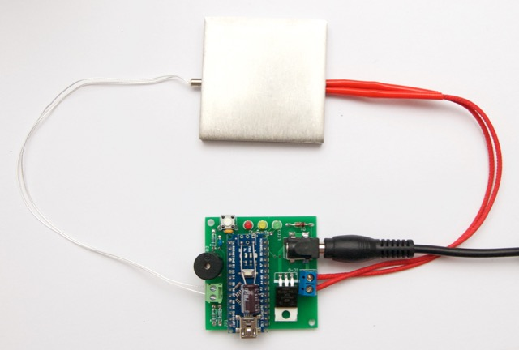

# ReflowOven
Arduino reflow oven voor de BEEA avond, 6 augustus 2015

De "bill-of-materials" staat [hier](board-v1/bill-of-materials.pdf).

## Opbouw reflow printje

Dit zijn de verbindingen op het bordje dat je gaat opbouwen:

### Stap 1: alle lage componenten

Let op de polariteit van de 3 LEDs en de zener diode!

Het knopje is een andere dan oorspronkelijk op de print voorzien is.

### Stap 2: drie connectoren

DC jack, kleine sensor aansluiting, grote heater aansluting:

Goed vastsolderen, vooral die DC voeding jack.

### Stap 3: Arduino Nano microcontroller

Pennen afknippen, zodat de onderkant redelijk vlak is.

### Stap 4: zoemer en extra dikke condensator

Let op polariteit van beide componenten:

### Stap 5: sensor + heater

De sensor in de groene schroefklemmen, heater in de blauwe:

Draden blank maken, liefst strippen en vertinnen, dan goed vastschroeven.

### Stap 6: software

Er moet een Arduino "sketch" in de Arduino worden geinstalleerd.  
Dat gaat via de USB stekker, en een USB driver voor de CH341 chip.  
De groene LED is altijd aan als de interne 5V regelaar stroom krijgt.

**Niet** de 19V voeding aansluiten tijdens deze actie!

### Stap 7

Controleren, controleren, controleren. En dan: _nog een laatste keertje..._
Als bijvoorbeeld de zener verkeerd om zit, krijg je gegarandeerd vuurwerk.
Pas als je zeker weet dat de zaak klopt, de 19V adapter inprikken.

Als alles goed aangesloten en ingesteld is, begint het plaatje warm te worden.  
Zet de zaak **alleen** aan als de heater goed in het koelblok geklemd zit!

## Opbouw demo bordje

...
